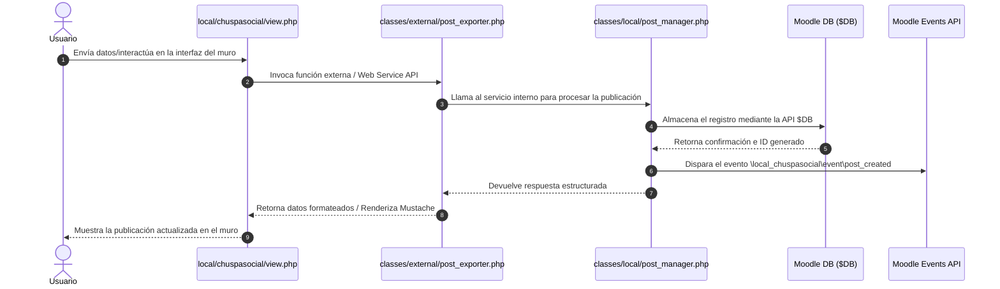

# Arquitectura del Sistema

## Visión general
`local_chuspasocial` es un plugin local para Moodle que extiende la plataforma con funcionalidades sociales mediante páginas propias como `view.php`, servicios internos en `classes/local/` para la lógica de negocio y funciones externas en `classes/external/` que exponen endpoints seguros para la interacción asíncrona vía AJAX.
El plugin `local_chuspasocial` para Moodle 4.5 implementa una arquitectura modular por capas enfocada en la mantenibilidad, escalabilidad y la integración nativa con el core de Moodle.

## Descripciones de capas y componentes

### 1. Servicios Internos (`classes/local/`)
Encapsulan las reglas de negocio, validaciones del sistema y lógica de dominio del plugin. Aíslan los controladores HTTP y las API externas de la manipulación directa de datos.
El plugin `local_chuspasocial` para Moodle 4.5 adopta una arquitectura por capas modular y orientada a servicios, diseñada para extender las capacidades sociales de Moodle manteniendo compatibilidad nativa con sus APIs core (`$DB`, Events API, Renderers y Forms API).

## Componentes principales
- **Vistas / Controladores de Página**: Puntos de entrada HTTP que procesan las peticiones del usuario (ej. `view.php`).
- **Funciones Externas (`classes/external/`)**: APIs para solicitudes AJAX y servicios web.
- **Servicios Internos (`classes/local/`)**: Encapsulan la lógica de negocio y validaciones del plugin (ej. `post_manager.php`).
- **Capa de Persistencia y Eventos**: Almacenamiento en base de datos mediante la API `$DB` de Moodle y emisión de eventos del sistema.

## Diagrama de arquitectura
```text
+-------------------------------------------------------+
|                   Capa de Presentación                |
|                   (view.php, UI)                      |
+-------------------------------------------------------+
                            |
                            v
+-------------------------------------------------------+
|             Capa de Servicios & APIs                  |
|     (classes/external/  |  classes/local/)            |
+-------------------------------------------------------+
              /                           \
             v                             v
+------------------------+   +--------------------------+
|  Persistencia Moodle   |   |   API de Eventos Moodle  |
|        ($DB)           |   |  (\local_chuspasocial\..) |
+------------------------+   +--------------------------+
```

### 2. Clases Persistent (`classes/persistent.php` / `classes/local/persistent/`)
Representan las entidades de datos y la capa de abstracción sobre la base de datos de Moodle (`$DB`). Gestionan la validación del esquema, las definiciones de campos y el ciclo de vida de los registros persistentes.

### 3. Funciones Externas (`classes/external/`)
Exponen endpoints y servicios web AJAX compatibles con la External API de Moodle. Se encargan de la recepción de solicitudes, validación de parámetros de entrada (`external_function_parameters`) y estructuración de respuestas devueltas al cliente.

### 4. Plantillas Mustache (`templates/`)
Definen la capa de presentación visual de la interfaz de usuario mediante sintaxis Mustache. Renderizan la estructura HTML de los componentes sociales del plugin de forma desacoplada de la lógica PHP.
| Componente | Tecnología | Versión | Justificación |
|---|---|---|---|
| **LMS Base** | Moodle | 4.5+ | Plataforma educativa principal sobre la cual se despliega el plugin local. |
| **Backend** | PHP | 8.1+ | Lenguaje nativo de desarrollo para la API y controladores de Moodle. |
| **Base de Datos** | MariaDB / PostgreSQL | 10.6+ / 13+ | Motores relacionales compatibles con la capa de abstracción `$DB` de Moodle. |
| **Frontend** | Mustache / JS (AMD/ES6) | Native | Motor de plantillas y clientes de script nativos de Moodle para UI dinámica. |

### 5. Módulos AMD (`amd/src/`)
Implementan la lógica del lado del cliente utilizando JavaScript (AMD/ES6). Gestionan las interacciones dinámicas del usuario, la manipulación del DOM y las llamadas asíncronas (AJAX) a las funciones externas de Moodle.

---

## Tecnologías utilizadas

| Capa / Componente | Ubicación / Tecnología | Justificación |
|---|---|---|
| **Lógica de Negocio** | `classes/local/` (PHP 8.1+) | Centraliza las reglas del dominio y la reutilización de código. |
| **Persistencia** | `Persistent` / API `$DB` | Abstracción ORM nativa de Moodle para manejo de tablas. |
| **API Externa / AJAX** | `classes/external/` | Expone funciones web seguras para interacción asíncrona. |
| **Interfaz de Usuario** | `templates/*.mustache` | Plantillas Mustache nativas para renderizado limpio. |
| **Frontend Dinámico** | `amd/src/*.js` | Módulos AMD/RequireJS para interactividad del cliente. |
### Decisión 1
**Contexto:** Necesidad de desacoplar la lógica de procesamiento de publicaciones de los controladores HTTP directos.  
**Decisión:** Implementar servicios locales en `classes/local/` (ej. `post_manager.php`) y funciones en `classes/external/` para peticiones AJAX.  
**Consecuencias:** Facilita la reutilización de código, simplifica las pruebas unitarias y mantiene la interfaz modular.

## Flujo de datos

El siguiente diagrama de secuencia detalta el flujo de datos cuando un usuario crea una nueva publicación en el muro:



1. El usuario interactúa con la vista principal (`view.php`).
2. Se procesa la solicitud invocando la API de función externa (`classes/external/`).
3. El manejador local (`classes/local/post_manager.php`) ejecuta la validación y lógica de negocio.
4. Se guarda el registro en la base de datos mediante la API `$DB`.
5. Se emite el evento `post_created` a través de la Events API de Moodle.
6. La respuesta se envía formateada a la vista y se renderiza el muro actualizado para el usuario.
