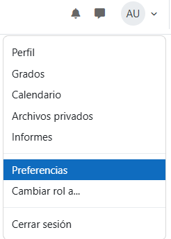
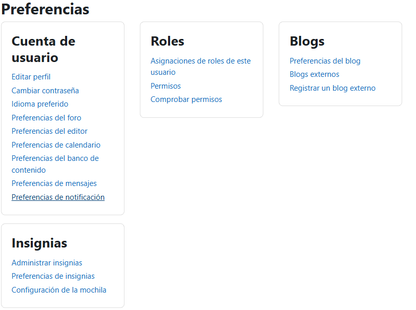

# Cómo silenciar las notificaciones
## Paso 1
haz clic en tu **icono de usuario** y luego un clic en **preferencias**.

## Paso 2
En cuenta de usuario haz un clic en **Preferencias de notificaciones**.

## Paso 3
Aqui puedes modificar las notificaciones que recibirás.